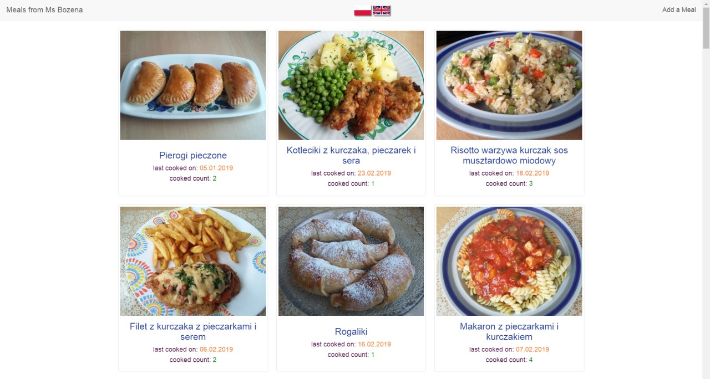

<h1 align="center">
  Meals - a diary of meals cooked
</h1>

to watch the demo:  
Visit: https://mums-meals.herokuapp.com

to run:  
Have: node.js installed  
Command: npm start  

to edit the meal database manually:  
Open: /meals.json
