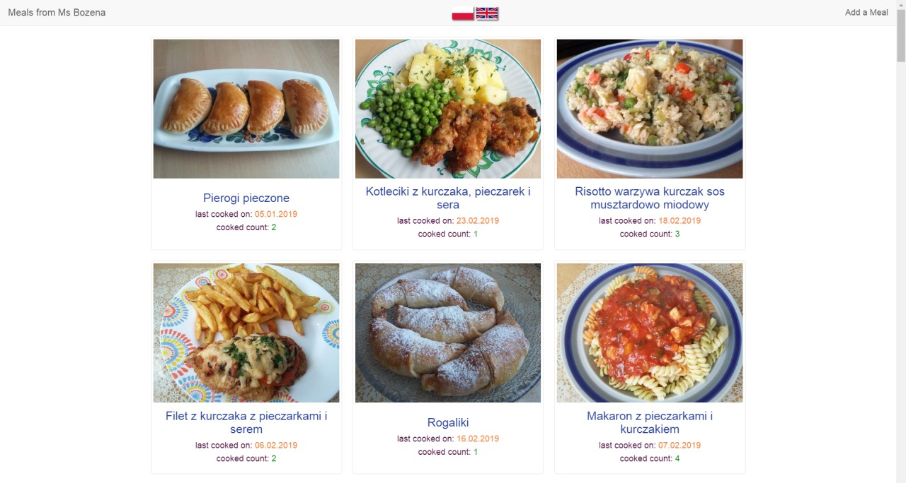

<h1 align="center">
  Meals - a journal of meals cooked
</h1>

to watch the demo:  
Visit: https://mums-meals.herokuapp.com

to edit a meal name, date, or count:  
Click it. Alter the text. Press enter or click out. Confirm the change.  

to run on your own machine:  
Have: node.js installed  
Clone or download this project  
Command 1: npm install  
Command 2: npm run serve  

to edit the configuration:  
Open: /shared/config.js  

to edit environmental variables:  
Open: /.env-template  

to edit the meal database manually:  
Open: /database/meals.json
